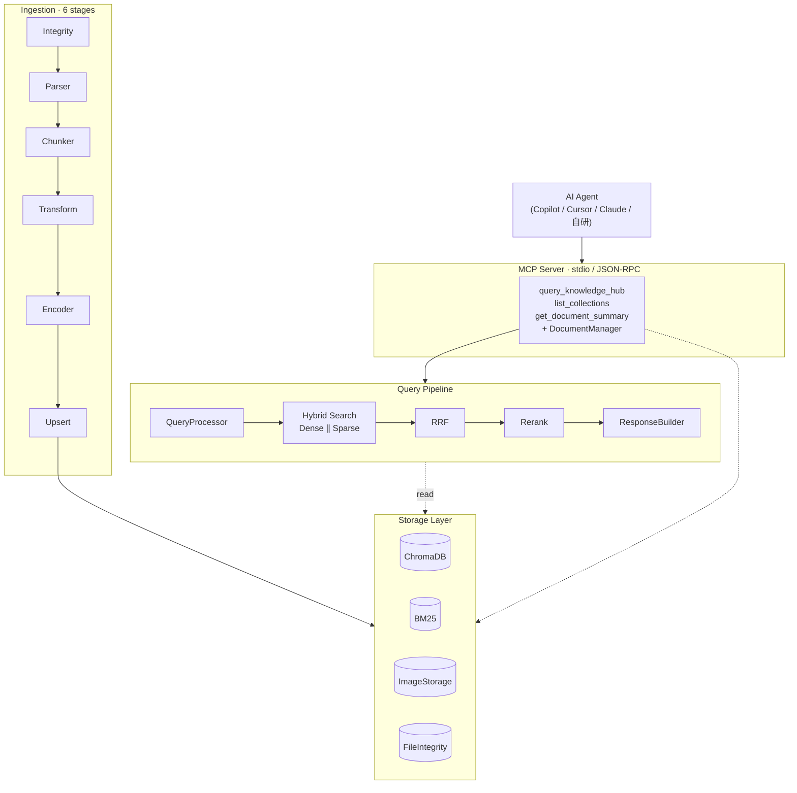

# Modular RAG MCP Server


一个把知识检索能力暴露给 AI Agent 的 RAG 后端。它通过 MCP 协议（stdio + JSON-RPC）对外提供服务，Copilot、Cursor、Claude Desktop、自研 Agent 都能直接接入。所有后端（LLM、Embedding、Parser、向量库）都可以在配置文件里切换，不用改代码。

**Python · MCP Protocol · ChromaDB · BM25 · LangChain · Streamlit · pytest**

> 这是一个学习导向、面向面试的实战项目，不是经过线上验证的生产系统。重点在架构思路和设计判断，不在功能堆砌。

> **当前默认配置是「纯本地英文文献 RAG」场景**：LLM / Embedding / Vision 全部走本地 Ollama，私有 PDF 不出机器。这不是写死的——换一个 `provider` 字段就能切回云端（智谱 / OpenAI / Azure / DeepSeek / Qwen），见 [几个关键设计](#几个关键设计) 和 [config/settings.yaml](config/settings.yaml)。

---

## 目录

- [它想解决什么](#它想解决什么)
- [快速开始](#快速开始)
- [系统架构](#系统架构)
- [几个关键设计](#几个关键设计)
- [工程上做了什么](#工程上做了什么)
- [怎么扩展](#怎么扩展)
- [测试](#测试)
- [已知边界](#已知边界)
- [相关文档](#相关文档)
- [License](#license)

---

## 它想解决什么

让 Agent 用上私有知识，最常见的做法是给它塞一个检索函数。这么做通常会遇到三件事：

1. **检索后端和 Agent 绑死了。** 换一个 embedding 模型、换一个向量库，Agent 那边的代码也得跟着动。
2. **PDF 很难处理。** 同一份文件里可能同时有原生文本、表格、矢量图、扫描件，用单一 parser 总会丢东西。
3. **文档删不干净。** 向量、倒排索引、图片、摄取记录散落在四个存储里，删一份文档要协调四套接口，漏一个就残留脏数据。

这个项目把这三件事都做成了可以在配置里切换的架构决策，而不是写死在代码里的功能。

---

## 快速开始

### 前提

- **Python ≥ 3.10**，推荐用 conda 管理环境（系统 Python 和 chromadb 经常打架）
- **本地 Ollama**（默认配置）：LLM 用 `granite4.1:8b`、Embedding 用 `nomic-embed-text`、Vision 用 `llava-phi3:3.8b`。先 `ollama serve` 再 `ollama pull <model>` 拉好这三个模型。
- 想走云端也行：切 OpenAI / Azure / DeepSeek / 智谱 / Qwen，把对应 `provider` 和 API Key 填进 [config/settings.yaml](config/settings.yaml) 即可（Key 从环境变量读）。

### 1. 安装

```bash
# 推荐：先建一个 conda 环境
conda create -n rag-mcp python=3.10 -y && conda activate rag-mcp

# editable 安装，带上 dev 工具
pip install -e ".[dev]"
```

### 2. 配置后端

所有后端选择（LLM / Embedding / Vision / Parser / Reranker / VectorStore）都写在 [config/settings.yaml](config/settings.yaml) 里。换后端就是改配置，不用动代码。仓库自带的 settings.yaml 已经是「纯本地英文文献」这一档默认值，开箱可跑；要切云端或别的 parser，改 `provider` 字段即可。

最小配置片段（与当前 [config/settings.yaml](config/settings.yaml) 对齐）：

```yaml
llm:
  provider: "ollama"           # 绝对本地，私有 PDF 不出机器（场景决策见 DEV_CHANGELOG D-024）
  model: "granite4.1:8b"
  base_url: "http://localhost:11434/v1"   # /v1 供 vision/embedding 的 OpenAI 兼容端点；文本 LLM 自动剥 /v1 用原生 /api/chat
embedding:
  provider: "ollama"           # 本地 nomic-embed-text；httpx 需 trust_env=False 绕系统代理（D-014）
  model: "nomic-embed-text"
  dimensions: 768
vision_llm:
  provider: "ollama"           # 含图 PDF 的图片描述（D-020）
  model: "llava-phi3:3.8b"
vector_store:
  provider: "chroma"
  collection_name: "knowledge_hub"
ingestion:
  parser:
    provider: "docling"        # 矢量图 bbox 渲染；降级链 docling→pdf_text
  chunk_refiner:
    use_llm: false             # 策略 C：溯源优先，关掉 LLM 精炼层（D-026）
```

### 3. 摄取、查询、启动服务

```bash
# 摄取文档
python scripts/ingest.py --path <file-or-dir> --collection <name>

# 跑一次查询
python scripts/query.py --query "..." --collection <name> --top-k 10

# 启动 MCP Server（Agent 通过 stdio 调用）
python -m src.mcp_server.server

# 启动 Dashboard（默认 :8501）
python scripts/start_dashboard.py
```

### 4. 让你的 Agent 连上来

MCP Server 走 stdio + JSON-RPC。在你的 MCP 客户端配置里加一项就行，下面这个 `.mcp.json` 在 VS Code / Cursor / Claude Desktop 上都通用：

```json
{
  "mcpServers": {
    "modular-rag": {
      "command": "python",
      "args": ["-m", "src.mcp_server.server"],
      "cwd": "<本仓库的绝对路径>"
    }
  }
}
```

连上之后，Agent 会拿到这几个工具：`query_knowledge_hub`、`list_collections`、`get_document_summary`，以及一组文档生命周期管理接口（增删查、跨存储清理）。

> 📷 **Dashboard 预览**：项目带一个 6 页的 Streamlit 管理界面，可以看 Trace、管理集合、跑评估回归。截图待补——运行 `python scripts/start_dashboard.py` 后访问 `http://localhost:8501` 就能看到，欢迎把截图放到 `docs/images/` 替换这一段。

---

## 系统架构



整体是四层设计。两条链路——Ingestion（摄取）和 Query（查询）——共用同一套存储层和 TraceContext。每个 stage 执行时的 method、provider、latency 都会落到 `logs/traces.jsonl`，Dashboard 直接读这个文件，没有再开一个 API。

---

## 几个关键设计

### 1. 用 Factory + Registry 做可插拔，不上 IoC 容器

RAG 的每个环节（LLM、Embedding、Parser、Reranker、VectorStore、Splitter）都有很多种实现，会随团队、成本、网络环境变。如果后端和业务逻辑绑在一起，换一个 Provider 就得改一串代码。

这里的做法是：每个可替换环节都抽象成 `Base* 抽象类 + *Factory + 类级 _PROVIDERS 注册表`。Pipeline 和 QueryEngine 只面向 `Base*` 编程，具体用哪个实现，由 `settings.yaml` 里的 `provider:` 字段在运行时决定。

```
src/libs/
├── llm/          → LLMFactory        (openai/azure/deepseek/ollama/qwen/zhipu)
├── embedding/    → EmbeddingFactory  (openai/azure/ollama/qwen/zhipu)
├── parser/       → ParserFactory     (pdf/pdf_text/pdf_table/docling/docling_vlm/docx)
├── reranker/     → RerankerFactory   (llm/cross_encoder)
├── splitter/     → SplitterFactory   (recursive)
├── vector_store/ → VectorStoreFactory(chroma)
└── evaluator/    → EvaluatorFactory  (scaffolded)
```

为什么不用 Spring 风格的 IoC 容器？在 Python 项目里那是过度设计。Factory + Registry 的注册就一行 `register_provider("foo", FooClass)`。加一个新 Provider，改动面只有三处：① 写一个新类文件，② 在工厂的 `_register_builtin_providers()` 里注册，③ 改 yaml 配置。Pipeline 和 Core 一行都不用动。

代价也是有的：抽象层多了一层间接调用，调试时得先跳 Factory 才能看到具体实现。这里的补偿是 Factory 注册时打日志，加上 Trace 里记一个 `method` 字段标明实际用了哪个 Provider。

对 Agent 这一层来说，意义在于：后端怎么换 Provider、换向量库，Agent 侧的 MCP 调用契约都不会变。

### 2. PDF 按场景分 parser，能力边界摆到台面上

PDF 是最棘手的文档格式。同一份文件里可能混着原生文本、线条/对齐型表格、嵌入位图、矢量绘制的图。没有任何单一工具能通吃，用错了就是表格变乱码、图直接丢。

这里的做法是让 PDF 解析有多个 Provider 并存，每个只做自己擅长的那部分，能力边界在表格里写清楚：

| Parser | 擅长场景 | 实现 | 局限 |
|---|---|---|---|
| `pdf_table` | 线条/对齐型表格（Word/Excel 导出的文本型 PDF） | pdfplumber | 表格→`table_html`(展示) + 清洗文本(检索) |
| `pdf_text` | 纯文本 PDF | MarkItDown | 不抽表格、不抽图 |
| `docling` | 矢量绘制的图（架构图/流程图） | bbox 区域渲染光栅 | 计算开销大 |
| `docling_vlm` | 复杂版式 / 扫描件 | VLM 理解页面 | 依赖 Vision LLM |

两个实际踩过的坑：

1. **矢量图为什么 PyMuPDF 抓不到。** 架构图是矢量画出来的，不是嵌进去的 PNG，所以 `get_images()` 返回空。解法是 `docling` 走 bbox 渲染抓矢量图，其它 parser 走 `get_images()` 抓嵌入位图——图片抽取按 parser 分路径。

2. **扫描件表格会降级。** `pdf_table` 检测到没有文本层（说明是扫描件）时，会自动降级到 `pdf_text` 纯文本模式，并在 metadata 上标 `degraded=true`。下游看到这个标记就知道这份文档的表格信息丢了，不会把它当高质量数据用。

### 3. 文档删除：跨四个存储协调清理，选 Fail-safe 而不是伪事务

文档数据散在四个独立存储里：Chroma（向量）、BM25（倒排）、ImageStorage（图片）、FileIntegrity（摄取历史）。如果只删 Chroma，BM25 倒排还在、图片文件还在、摄取记录还在，残留的数据会污染后续检索。

这里的入口只有一个 `DocumentManager`，一次调用会级联清理四个存储：

```
delete_document(path)
  ├─ 1. 解析 doc_hash（caller 传入 → 算 SHA256 → 查 DB）
  ├─ 2. ChromaDB:  delete_by_metadata({"doc_hash": hash})
  ├─ 3. BM25:      remove_document(hash, collection)
  ├─ 4. ImageStorage: 逐个 delete_image(image_id)
  └─ 5. FileIntegrity: remove_record(hash)
```

为什么不在四个存储之间做事务？因为 Chroma、BM25、SQLite 三者根本不共享事务边界，硬套一个伪事务反而更脆。这里选的是 Fail-safe：任何一步失败都捕获下来、写进 `DeleteResult.errors`、继续清剩下的存储。理由是残留数据比"部分删除"更糟——宁可留下错误日志让运维补删，也不能因为 BM25 删失败就让 Chroma 里的脏数据一直留着。

底下还有两层幂等兜底：

- **文件级**：SHA256 存在 FileIntegrity 里，没改过的文件直接跳过，增量摄取几乎是零成本。
- **chunk 级**：`chunk_id = {doc_id}_{index:04d}_{content_hash8}` 是确定性生成的，upsert 天然幂等，重复摄取不会产生重复向量。

### 4. 英文 BM25 分词：单一 tokenizer + Porter stemmer，索引和查询必须对齐

BM25 是稀疏检索，**索引侧切成什么 term，查询侧就得切成什么 term，否则查了等于没查**。这个项目一开始只有中文，分词用的是 jieba，英文只是顺手切一下。等切到「英文文献」场景，这个顺手切法立刻暴露两类问题：

1. **同源词不收敛**：`optimization` / `optimize` / `optimizing` 在 jieba 眼里是三个不同的 token，查 `optimize` 召不回索引里的 `optimization`。
2. **索引/查询两侧分词逻辑漂移**：SparseEncoder 和 QueryProcessor 各写一份 `_tokenize`，一开始就长歪了——索引侧保留 TF（不去重），查询侧去重；索引侧 `min_term_length=2`，查询侧 `=1`。结果是查询 token 经常落在索引从来不存的集合里，**零召回噪声**。

这里的做法是把分词收口到**一个公共 tokenizer**（`src/core/text/tokenizer.py`），索引侧和查询侧都调用它，只是参数不同：

```
src/core/text/
├── porter_stemmer.py  → 零依赖 Porter stemmer（Porter 1980，纯 Python 实现）
└── tokenizer.py       → tokenize() 单一真相源
```

设计纪律是这样的（`tokenize()` 一个函数解决）：

| 约束 | 怎么实现 |
|---|---|
| 同源词收敛 | Porter stemmer：`optimization`/`optimize` → `optim` |
| 技术词不被切碎 | `C++` / `C#` 这种带符号的 token 走 `_TECH_TOKEN_RE` 整体保留，绕过标点切分 |
| 停用词 stem 后也能滤掉 | 停用词先 stem 再建集合（`used`→`us`、`because`→`becaus` 都会被滤） |
| 索引/查询对齐 | 两边都用 `tokenize()`；索引侧 `dedupe=False`（保留 TF），查询侧 `dedupe=True` |
| 不产生零召回 term | 查询侧 `min_term_length=2` 对齐索引侧，单字不进 keyword |

> **纪律级约束**：查询侧 keyword 必须是索引侧 term 的子集。这不是惯例，是 BM25 召回的**充要条件**，有一个跨层测试（`tests/unit/test_query_processor.py::TestCrossLayerTokenization`）专门守这条不变量——任何破坏对齐的改动都会被它拦下来。

为什么不直接上 NLTK / spaCy？因为这是「绝对本地」场景，多一个依赖就多一个联网下载的口子（NLTK 要下语料、spaCy 要下模型）。Porter 算法是 1980 年的论文，零依赖纯实现就两三百行，够用且可控。

---

## 工程上做了什么

除了功能本身，有几件事是为了让这个项目在复杂场景下不崩：

| 做的事 | 怎么做 | 为什么 |
|---|---|---|
| MCP stdio 的 stdout 约束 | 所有 log 重定向到 stderr，stdout 只走 JSON-RPC | log 一旦污染协议流，Client 解析就会失败 |
| 规避 import-lock 死锁 | chromadb 这类重依赖在主线程预加载 | 否则 anyio I/O 线程下 `asyncio.to_thread` 会触发 import 死锁 |
| Trace 字段分两层 | 稳定的 stage 类别 + 可变的 method 字段 | 换后端不会破坏 Dashboard 的渲染 |
| 优雅降级 | LLM 变换失败回退到规则逻辑；Reranker 失败回退到 RRF 序 | 单点故障不能阻断主链路 |
| 三层测试 | unit / integration / e2e，e2e 用子进程拉起真实 MCP Server | 分别覆盖独立逻辑、模块交互、完整链路 |

---

## 怎么扩展

举两个最常见的扩展场景，看看架构是不是真的解耦。

**加一个新 LLM Provider**（比如自研模型）：

1. 在 `src/libs/llm/foo.py` 写一个 `class FooLLM(BaseLLM)`
2. 调一次 `LLMFactory.register_provider("foo", FooLLM)`
3. 把 `settings.yaml` 里的 `llm.provider` 改成 `foo`

**加一个新文档格式**（比如 HTML）：

1. 在 `src/libs/parser/foo_parser.py` 写一个 `class FooParser(BaseParser)`
2. 调一次 `ParserFactory.register_provider("foo", FooParser)`
3. 把 `settings.yaml` 里的 `ingestion.parser.provider` 改成 `foo`

两条 pipeline 都不用动。更详细的扩展指南在 [.claude/rules/extending-backends.md](.claude/rules/extending-backends.md)。

---

## 测试

```bash
pytest                       # 全量
pytest tests/unit            # 单层
pytest -m "not llm"          # 跳过需要真实 LLM API 的用例
ruff check . && mypy src     # lint + 类型检查
```

测试分三层：`unit`（单元）、`integration`（集成）、`e2e`（端到端）。e2e 会以子进程拉起一个真实的 MCP Server，跑一遍完整链路。检索质量用 golden test set 做回归（`scripts/evaluate.py`）。

---

## 已知边界

有几处地方还没做完，或者本来就不打算做，写在这里免得误导：

| 项 | 状态 | 说明 |
|---|---|---|
| Custom Evaluator | 框架已搭，没完整测 | 可以独立补完 |
| Cross-Encoder Reranker | 框架已搭，没完整测 | 需要下载本地模型 |
| 扫描件表格 | 不支持（需要 OCR） | `pdf_table` 会自动降级到纯文本，标 `degraded=true` |
| 生产级高可用 | 没做 | 架构上留了空间（查询无状态 + 后端可插拔） |

---

## 相关文档

- [DEV_CHANGELOG.md](DEV_CHANGELOG.md) — 这个项目的设计决策真相源：每条决策记背景/备选/理由/代价（D-001 ~ D-026）。「为什么这么定」看这里（纯本地切换看 D-024、英文分词改造看 D-025、chunk_refiner 关 LLM 看D-026）
- [CLAUDE.md](CLAUDE.md) — AI Agent 协作指引（架构约定、命令、易踩的坑）

---

## License

[MIT](LICENSE) © 2026 Canyon-Li
