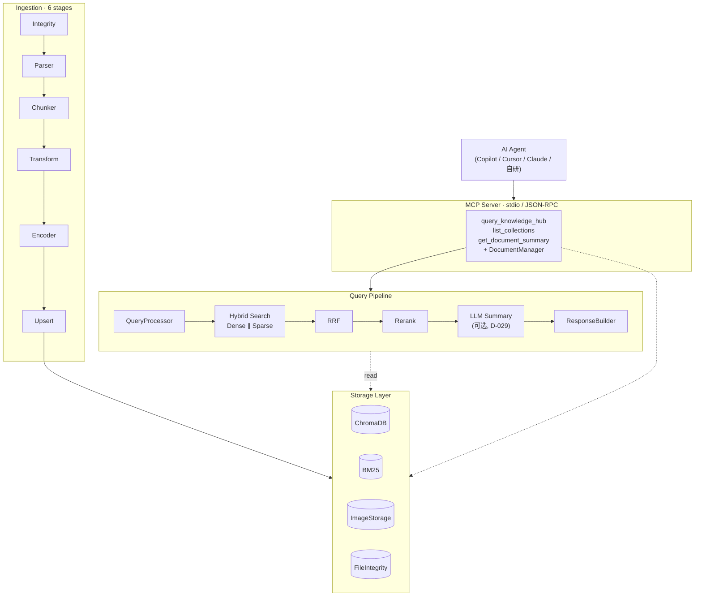

# Modular RAG MCP Server


一个将知识检索能力以标准化工具形式提供给 AI Agent 的 RAG 后端服务。系统通过 MCP 协议（stdio + JSON-RPC）对外提供服务，Copilot、Cursor、Claude Desktop 及自研 Agent 均可直接接入。所有后端组件（LLM、Embedding、Parser、向量库）均通过配置文件切换，无需修改代码。

**Python · MCP Protocol · ChromaDB · BM25 · LangChain · Streamlit · pytest**

> 本项目为学习导向的实战项目，并非经过生产环境验证的系统。重点在于架构思路与设计判断，而非功能罗列。

> **当前默认配置面向「纯本地英文文献 RAG」场景**：LLM / Embedding / Vision 全部运行于本地 Ollama，私有 PDF 不离开本机。该默认值并非硬编码——修改 `provider` 字段即可切换至云端服务（智谱 / OpenAI / Azure / DeepSeek / Qwen），详见 [几个关键设计](#几个关键设计) 与 [config/settings.yaml](config/settings.yaml)。

---

## 目录

- [它想解决什么](#它想解决什么)
- [快速开始](#快速开始)
- [评估](#评估)
- [系统架构](#系统架构)
- [几个关键设计](#几个关键设计)
- [工程实践](#工程实践)
- [怎么扩展](#怎么扩展)
- [测试](#测试)
- [已知边界](#已知边界)
- [相关文档](#相关文档)
- [License](#license)

---

## 它想解决什么

为 Agent 提供私有知识检索能力，常见做法是为其封装一个检索函数。这种做法通常会遇到三个问题：

1. **检索后端与 Agent 耦合。** 更换 embedding 模型或向量库时，Agent 侧代码也需要随之修改。
2. **PDF 处理困难。** 同一份文件可能同时包含原生文本、表格、矢量图、扫描件，单一 parser 难免丢失内容。
3. **文档删除不彻底。** 向量、倒排索引、图片、摄取记录分散在四个存储中，删除一份文档需要协调四套接口，遗漏任何一处都会残留脏数据。

本项目将这三个问题都转化为可通过配置切换的架构决策，而非硬编码在代码中的功能。

---

## 快速开始

### 前提

- **Python ≥ 3.10**，推荐使用 conda 管理环境（系统 Python 与 chromadb 存在已知的兼容性问题）
- **本地 Ollama**（默认配置）：LLM 使用 `granite4.1:8b`、Embedding 使用 `nomic-embed-text`、Vision 使用 `llava-phi3:3.8b`。先执行 `ollama serve`，再通过 `ollama pull <model>` 拉取上述三个模型。
- 也可切换至云端服务：将对应的 `provider` 与 API Key 配置到 [config/settings.yaml](config/settings.yaml) 即可（Key 从环境变量读取）。

### 1. 安装

```bash
# 推荐先创建 conda 环境
conda create -n rag-mcp python=3.10 -y && conda activate rag-mcp

# editable 安装，包含 dev 工具
pip install -e ".[dev]"

# 可选：cross-encoder 重排（重依赖，引入 torch）；不安装则 rerank 走 none/llm
# pip install -e ".[cross-encoder]"
```

> Windows 环境下建议使用 conda 而非 `.venv`——系统 Python 与 chromadb 的兼容性经常出现问题。

### 2. 配置后端

**仓库默认配置开箱可运行**：全部后端走本地 Ollama，无需填写任何 API Key。系统有两个配置入口，分工如下：

| 入口 | 管理内容 | 何时需要修改 |
|---|---|---|
| [config/settings.yaml](config/settings.yaml) | 检索链路后端：LLM / Embedding / Vision / Parser / Reranker / VectorStore | 更换后端时修改 `provider` 字段 |
| `.env`（从 [.env.example](.env.example) 复制） | 评估 judge 的 API Key 与模型选择 | 仅在评估需要切换云端 judge 时 |

所有后端选择（LLM / Embedding / Vision / Parser / Reranker / VectorStore）均配置在 [config/settings.yaml](config/settings.yaml) 中。更换后端仅需修改配置，无需改动代码。仓库自带的 settings.yaml 已是「纯本地英文文献」档位的默认值，开箱可用；切换云端或其他 parser 时，修改 `provider` 字段即可。

最小配置片段（与当前 [config/settings.yaml](config/settings.yaml) 对齐）：

```yaml
llm:
  provider: "ollama"           # 绝对本地，私有 PDF 不出机器（场景决策见 DEV_CHANGELOG D-024）
  model: "granite4.1:8b"
  base_url: "http://localhost:11434/v1"   # /v1 供 vision/embedding 的 OpenAI 兼容端点；文本 LLM 自动剥 /v1 用原生 /api/chat
embedding:
  provider: "ollama"           # 本地 nomic-embed-text；httpx 需 trust_env=False 绕系统代理（D-014）
  model: "nomic-embed-text"
  dimensions: 768
vision_llm:
  provider: "ollama"           # 含图 PDF 的图片描述（D-020）
  model: "llava-phi3:3.8b"
vector_store:
  provider: "chroma"
  collection_name: "knowledge_hub"
ingestion:
  parser:
    provider: "docling"        # 矢量图 bbox 渲染；降级链 docling→pdf_text
  chunk_refiner:
    use_llm: false             # 策略 C：溯源优先，关掉 LLM 精炼层（D-026）
generation:
  enabled: true                # 查询后由 LLM 生成带 [n] 引用标记的总结（D-029）
  max_chunks: 10               # 喂给 LLM 的 chunk 上限（编号与响应引用列表一致）
```

### 3. 摄取、查询、启动服务

```bash
# 摄取文档（PDF/DOCX，格式由 settings.yaml 的 ingestion.parser.provider 决定）
python scripts/ingest.py --path <file-or-dir> --collection <name>

# 执行一次查询（混合检索：dense + BM25 → RRF 融合 → 可选 LLM 总结带 [n] 引用标记）
python scripts/query.py --query "..." --collection <name> --top-k 10

# 启动 MCP Server（Agent 通过 stdio 调用）
python -m src.mcp_server.server

# 启动 Dashboard（默认 :8501）
python scripts/start_dashboard.py
```

### 4. 接入 Agent

MCP Server 通过 stdio + JSON-RPC 通信。在 MCP 客户端配置中添加以下条目即可，该 `.mcp.json` 适用于 VS Code / Cursor / Claude Desktop：

```json
{
  "mcpServers": {
    "modular-rag": {
      "command": "python",
      "args": ["-m", "src.mcp_server.server"],
      "cwd": "<本仓库的绝对路径>"
    }
  }
}
```

连接建立后，Agent 可使用以下工具：`query_knowledge_hub`、`list_collections`、`get_document_summary`，以及一组文档生命周期管理接口（增删查、跨存储清理）。

> **Dashboard 预览**：项目内置一个 6 页的 Streamlit 管理界面，支持查看 Trace、管理集合、执行评估回归。运行 `python scripts/start_dashboard.py` 后访问 `http://localhost:8501` 即可使用。

### Web 问答服务（多租户，D-032）

除 MCP 接入外，系统同时以**纯 Web 服务**形态提供问答（公有库 + 个人库多租户，服务端 ACL）：

```powershell
# 终端 1：FastAPI 服务（默认 :8300；种子用户 u001=业务员 / admin001=管理员）
uvicorn src.api.app:app --port 8300

# 终端 2：Streamlit 聊天页（引用展开、个人库上传）
streamlit run scripts/chat_app.py
```

主要接口：`POST /api/query`（跨库检索+融合+带 `[n]` 引用生成）、`POST /api/ingest`（异步摄取，`GET /api/tasks/{id}` 轮询进度）、`GET /api/libraries` / `GET /api/documents`。身份经 `X-User-Id` 头传入（demo 认证，权限判定全部在服务端完成；生产部署替换为 SSO）。设计见 [docs/enterprise-rag-design.md](docs/enterprise-rag-design.md)。

---

## 评估

检索质量通过 golden test set 进行回归验证，而非主观判断。一条评估命令的流程为：执行真实检索 + 计算五个指标，全量运行约需数分钟。

### 五个指标

| 指标 | 判定方式 | 度量内容 |
|---|---|---|
| `source_recall@k` | 确定性集合运算（零 LLM） | 应命中的论文是否进入 top-k |
| `source_precision@k` | 确定性集合运算 | top-k 中正确论文的占比 |
| `context_relevance` | LLM judge（RAGAS） | 检索内容与问题的相关性 |
| `context_precision` | LLM judge（RAGAS） | 相关 chunk 的排序质量 |
| `context_recall` | LLM judge（RAGAS） | **应召回的信息是否被覆盖**（漏检侧，v2 新增） |

GT 来自 [tests/fixtures/golden_test_set.json](tests/fixtures/golden_test_set.json)：`query` + `expected_sources`（论文文件名）+ `reference`（论断式参考答案，供语义指标判定）。设计原则：**确定性可量度的（文档级命中）不使用 LLM，需要语义判断的（chunk 级）才使用 LLM**——当 judge 出现波动时，source 指标可作为零方差的故障对照锚点。

### 运行评估

**第一步：准备语料。** 评估论文 PDF 存放在 `tests/fixtures/eval_docs/`，因版权原因不入 git（目录已 gitignore）。复现评估时，按 [tests/fixtures/eval_docs/README.md](tests/fixtures/eval_docs/README.md) 中的论文清单自行获取同名 PDF 放入该目录，然后摄取：

```bash
python scripts/ingest.py --path tests/fixtures/eval_docs/ --collection evaluation
```

**第二步：执行评估。**

```bash
# 默认：本地 ollama judge（llama3），需先 ollama pull llama3
python scripts/evaluate.py --test-set tests/fixtures/golden_test_set.json \
    --collection evaluation --top-k 5

# 推荐：云端 DeepSeek judge（速度快、结果稳定，不占用本地资源）
cp .env.example .env           # 填入 DEEPSEEK_API_KEY，.env 已 gitignore
python scripts/evaluate.py --test-set tests/fixtures/golden_test_set.json \
    --collection evaluation --top-k 5 --json -o logs/eval_report.json
```

- `--top-k`：每条 query 检索的 chunk 数，golden set 按此口径标注（当前为 5）；
- `--json` + `-o`：将机器可读输出写入文件（长报告在控制台可能被截断，建议落盘保存）；
- 每次运行默认追加至 `logs/eval_history.jsonl`（Dashboard 评估页读取该文件）；
- judge 与被测检索链路**完全解耦**：检索侧模型可以任意更换，judge 由环境变量决定，避免"既当运动员又当裁判"的评估偏差。

> **DeepSeek judge 存在连续请求限流**：23 条全量连续运行可能中途阻塞。分批运行（每批 2 条、批间隔 15 秒）可稳定跑完全量。该参数为实测结论，详见 [docs/eval-v2-baseline-report.md](docs/eval-v2-baseline-report.md) §6。

### 查看结果

- **控制台**：运行结束后打印 aggregate 与 per-query 指标（含 `█░` 条形图）；
- **Dashboard**：`python scripts/start_dashboard.py` → 评估页，读取 `logs/eval_history.jsonl` 绘制历史趋势；
- **指标体系设计依据**：v1 四指标对漏检失明的原因、GT 不使用 chunk_id 的理由，论证见 [docs/eval-metrics-upgrade-v2.md](docs/eval-metrics-upgrade-v2.md)；首轮全量基线（含调参优先级）见 [docs/eval-v2-baseline-report.md](docs/eval-v2-baseline-report.md)。

---

## 系统架构



整体为四层设计。两条链路——Ingestion（摄取）与 Query（查询）——共用同一套存储层和 TraceContext。每个 stage 执行时的 method、provider、latency 均记录至 `logs/traces.jsonl`，Dashboard 直接读取该文件，无需额外 API。

---

## 几个关键设计

### 1. 用 Factory + Registry 做可插拔，不上 IoC 容器

RAG 的每个环节（LLM、Embedding、Parser、Reranker、VectorStore、Splitter）都存在多种实现，且会随团队、成本、网络环境而变化。如果后端与业务逻辑耦合，更换 Provider 就需要修改一串代码。

本项目的做法是：将每个可替换环节抽象为 `Base* 抽象类 + *Factory + 类级 _PROVIDERS 注册表`。Pipeline 和 QueryEngine 只面向 `Base*` 编程，具体使用哪个实现，由 `settings.yaml` 中的 `provider:` 字段在运行时决定。

```
src/libs/
├── llm/          → LLMFactory        (openai/azure/deepseek/ollama/qwen/zhipu)
├── embedding/    → EmbeddingFactory  (openai/azure/ollama/qwen/zhipu)
├── parser/       → ParserFactory     (pdf/pdf_text/pdf_table/docling/docling_vlm/docx)
├── reranker/     → RerankerFactory   (llm/cross_encoder)
├── splitter/     → SplitterFactory   (recursive)
├── vector_store/ → VectorStoreFactory(chroma)
└── evaluator/    → EvaluatorFactory  (scaffolded)
```

为什么不用 Spring 风格的 IoC 容器？在 Python 项目中属于过度设计。Factory + Registry 的注册仅需一行 `register_provider("foo", FooClass)`。新增 Provider 的改动面只有三处：① 编写新类文件，② 在工厂的 `_register_builtin_providers()` 中注册，③ 修改 yaml 配置。Pipeline 和 Core 无需任何改动。

代价同样存在：抽象层增加了一层间接调用，调试时需先经过 Factory 才能查看具体实现。对应的补偿措施是 Factory 在注册时输出日志，并在 Trace 中记录 `method` 字段以标明实际使用的 Provider。

对 Agent 层而言，其意义在于：无论后端如何更换 Provider 或向量库，Agent 侧的 MCP 调用契约保持不变。

### 2. PDF 按场景分 parser，能力边界显式声明

PDF 是最棘手的文档格式。同一份文件可能混合原生文本、线条/对齐型表格、嵌入位图、矢量绘图。没有任何单一工具能够覆盖全部情况，使用不当会导致表格乱码或图片丢失。

本项目的做法是让 PDF 解析保持多个 Provider 并存，各自负责擅长的场景，能力边界在表格中明确标注：

| Parser | 擅长场景 | 实现 | 局限 |
|---|---|---|---|
| `pdf_table` | 线条/对齐型表格（Word/Excel 导出的文本型 PDF） | pdfplumber | 表格→`table_html`(展示) + 清洗文本(检索) |
| `pdf_text` | 纯文本 PDF | MarkItDown | 不抽表格、不抽图 |
| `docling` | 矢量绘制的图（架构图/流程图） | bbox 区域渲染光栅 | 计算开销大 |
| `docling_vlm` | 复杂版式 / 扫描件 | VLM 理解页面 | 依赖 Vision LLM |

两个实际遇到的问题：

1. **矢量图无法被 PyMuPDF 抓取的原因。** 架构图由矢量绘制而非嵌入位图，因此 `get_images()` 返回空。解决方案是 `docling` 通过 bbox 渲染抓取矢量图，其他 parser 通过 `get_images()` 抓取嵌入位图——图片抽取按 parser 分路径实现。

2. **扫描件表格的降级处理。** `pdf_table` 检测到无文本层（即为扫描件）时，自动降级至 `pdf_text` 纯文本模式，并在 metadata 上标记 `degraded=true`。下游识别该标记即可得知该文档的表格信息已丢失，不会将其作为高质量数据使用。

### 3. 文档删除：跨四个存储协调清理，选 Fail-safe 而不是伪事务

文档数据分散在四个独立存储中：Chroma（向量）、BM25（倒排）、ImageStorage（图片）、FileIntegrity（摄取历史）。如果只删除 Chroma，BM25 倒排、图片文件、摄取记录仍然存在，残留数据会污染后续检索。

本项目的删除入口只有一个 `DocumentManager`，一次调用级联清理四个存储：

```
delete_document(path)
  ├─ 1. 解析 doc_hash（caller 传入 → 算 SHA256 → 查 DB）
  ├─ 2. ChromaDB:  delete_by_metadata({"doc_hash": hash})
  ├─ 3. BM25:      remove_document(hash, collection)
  ├─ 4. ImageStorage: 逐个 delete_image(image_id)
  └─ 5. FileIntegrity: remove_record(hash)
```

为什么不在四个存储之间实现事务？因为 Chroma、BM25、SQLite 三者不共享事务边界，强行套用伪事务反而更脆弱。本项目选择 Fail-safe 策略：任何一步失败都会被捕获、写入 `DeleteResult.errors`，并继续清理剩余存储。理由是残留数据的危害大于"部分删除"——宁可保留错误日志供运维补删，也不能因 BM25 删除失败而让 Chroma 中的脏数据长期留存。

此外还有两层幂等保障：

- **文件级**：SHA256 记录在 FileIntegrity 中，未修改的文件直接跳过，增量摄取几乎零成本。
- **chunk 级**：`chunk_id = {doc_id}_{index:04d}_{content_hash8}` 确定性生成，upsert 天然幂等，重复摄取不会产生重复向量。

### 4. 英文 BM25 分词：单一 tokenizer + Porter stemmer，索引和查询必须对齐

BM25 是稀疏检索，**索引侧切分的 term 必须与查询侧一致，否则查询将无法命中**。本项目最初仅支持中文，分词使用 jieba，英文只是附带处理。切换到「英文文献」场景后，该做法立即暴露两类问题：

1. **同源词不收敛**：`optimization` / `optimize` / `optimizing` 在 jieba 处理下是三个不同的 token，查询 `optimize` 无法召回索引中的 `optimization`。
2. **索引/查询两侧分词逻辑漂移**：SparseEncoder 与 QueryProcessor 各自实现一份 `_tokenize`，从初期就已偏离——索引侧保留 TF（不去重），查询侧去重；索引侧 `min_term_length=2`，查询侧 `=1`。结果是查询 token 经常落在索引从未存储的集合中，产生**零召回噪声**。

本项目的做法是将分词收口到**一个公共 tokenizer**（`src/core/text/tokenizer.py`），索引侧与查询侧均调用它，仅参数不同：

```
src/core/text/
├── porter_stemmer.py  → 零依赖 Porter stemmer（Porter 1980，纯 Python 实现）
└── tokenizer.py       → tokenize() 单一真相源
```

设计约束如下（由 `tokenize()` 一个函数实现）：

| 约束 | 实现方式 |
|---|---|
| 同源词收敛 | Porter stemmer：`optimization`/`optimize` → `optim` |
| 技术词不被切碎 | `C++` / `C#` 等带符号 token 通过 `_TECH_TOKEN_RE` 整体保留，绕过标点切分 |
| 停用词 stem 后仍可过滤 | 停用词先 stem 再建集合（`used`→`us`、`because`→`becaus` 均被过滤） |
| 索引/查询对齐 | 两侧均调用 `tokenize()`；索引侧 `dedupe=False`（保留 TF），查询侧 `dedupe=True` |
| 不产生零召回 term | 查询侧 `min_term_length=2` 与索引侧对齐，单字不进入 keyword |

> **纪律级约束**：查询侧 keyword 必须是索引侧 term 的子集。这不是惯例，而是 BM25 召回的**充要条件**。项目设有一个跨层测试（`tests/unit/test_query_processor.py::TestCrossLayerTokenization`）专门守护该不变量——任何破坏对齐的改动都会被拦截。

为什么不直接采用 NLTK / spaCy？因为本项目面向「绝对本地」场景，每增加一个依赖就多一个联网下载入口（NLTK 需下载语料、spaCy 需下载模型）。Porter 算法是 1980 年的论文，零依赖纯实现仅需两三百行，够用且可控。

---

## 工程实践

除功能本身外，以下措施用于保证系统在复杂场景下的稳定性：

| 措施 | 实现方式 | 目的 |
|---|---|---|
| MCP stdio 的 stdout 约束 | 所有日志重定向至 stderr，stdout 仅传输 JSON-RPC | 日志一旦污染协议流，Client 解析即失败 |
| 规避 import-lock 死锁 | chromadb 等重依赖在主线程预加载 | 避免 anyio I/O 线程下 `asyncio.to_thread` 触发 import 死锁 |
| Trace 字段分两层 | 稳定的 stage 类别 + 可变的 method 字段 | 更换后端不会破坏 Dashboard 的渲染 |
| 优雅降级 | LLM 变换失败回退至规则逻辑；Reranker 失败回退至 RRF 序 | 单点故障不阻断主链路 |
| 三层测试 | unit / integration / e2e，e2e 以子进程拉起真实 MCP Server | 分别覆盖独立逻辑、模块交互、完整链路 |

---

## 怎么扩展

以下通过两个最常见的扩展场景，验证架构的解耦程度。

**新增一个 LLM Provider**（如自研模型）：

1. 在 `src/libs/llm/foo.py` 中编写 `class FooLLM(BaseLLM)`
2. 调用一次 `LLMFactory.register_provider("foo", FooLLM)`
3. 将 `settings.yaml` 中的 `llm.provider` 改为 `foo`

**新增一个文档格式**（如 HTML）：

1. 在 `src/libs/parser/foo_parser.py` 中编写 `class FooParser(BaseParser)`
2. 调用一次 `ParserFactory.register_provider("foo", FooParser)`
3. 将 `settings.yaml` 中的 `ingestion.parser.provider` 改为 `foo`

两条 pipeline 均无需改动。更详细的扩展指南见 [.claude/rules/extending-backends.md](.claude/rules/extending-backends.md)。

---

## 测试

```bash
pytest                       # 全量
pytest tests/unit            # 单层
pytest -m "not llm"          # 跳过需要真实 LLM API 的用例
ruff check . && mypy src     # lint + 类型检查
```

测试分三层：`unit`（单元）、`integration`（集成）、`e2e`（端到端）。e2e 以子进程拉起真实的 MCP Server，验证完整链路。检索质量通过 golden test set 进行回归（见[评估](#评估)）。

---

## 已知边界

以下内容尚未完成，或不计划实现，在此明确说明以避免误导：

| 项 | 状态 | 说明 |
|---|---|---|
| Custom Evaluator | 框架已搭建，未完整测试 | 可独立补完 |
| Cross-Encoder Reranker | 框架已搭建，未完整测试 | 需下载本地模型 |
| 扫描件表格 | 不支持（需要 OCR） | `pdf_table` 会自动降级到纯文本，标记 `degraded=true` |
| 生产级高可用 | 未实现 | 架构上预留了空间（查询无状态 + 后端可插拔） |

---

## 相关文档

- [DEV_CHANGELOG.md](DEV_CHANGELOG.md) — 本项目设计决策的真相源：每条决策记录背景/备选/理由/代价（D-001 ~ D-026）。「为什么这么定」请查阅此文档（纯本地切换见 D-024、英文分词改造见 D-025、chunk_refiner 关闭 LLM 见 D-026）
- [CLAUDE.md](CLAUDE.md) — AI Agent 协作指引（架构约定、命令、注意事项）

---

## License

[MIT](LICENSE) © 2026 Canyon-Li
